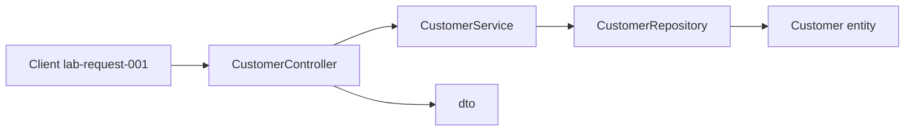

# Layer flow — create Amina Khan (`CUS-1001`)

Correlation ID: `lab-request-001`

1. Client sends create request (correlation ID `lab-request-001`)
2. `CustomerController` accepts `CustomerRequest` — validation at this boundary later
3. `CustomerService` applies business rules — list 1–2 rules (unique ID, status default)
4. `CustomerRepository` stores `Customer` entity — in-memory now vs PostgreSQL later
5. Response DTO returns `CUS-1001` / `ACTIVE` — without leaking internal storage type

## NOW vs FUTURE

- **NOW (Lab 8):** skeleton + stubs only
- **FUTURE:** Angular SPA, Kafka, PostgreSQL / Spring Boot — out of scope for Lab 8

## Optional Mermaid

